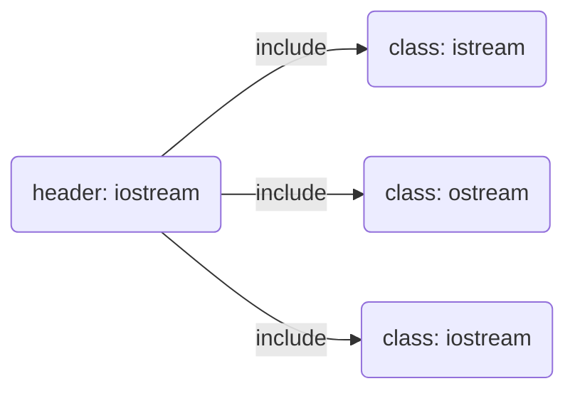
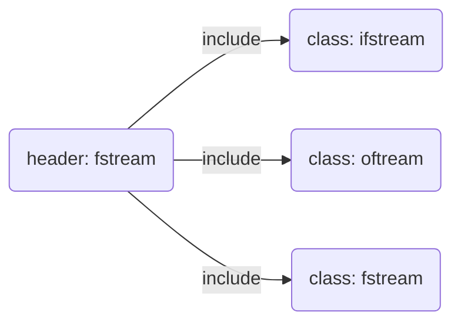
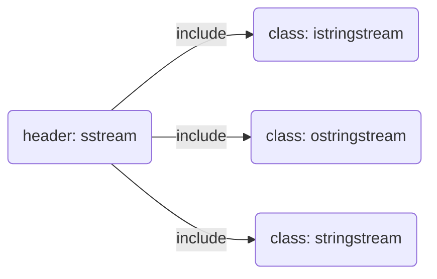

# The IO Classes
## 1. IO Library Types and headers

>To support these different kinds of IO processing, the library defines a collection of IO types in addition to the istream and ostream types that we have already used. The libaray defines these types in three separate headers:

- **iostream**
Defining the basic types used to read from and write to a stream.


- **fstream**
Defining the types used to read and write named files.


- **sstream**
Defining the types used to read and write in-memory strings


## 2. No Copy And Assign For IO Objects
>Because we can't copy the IO types, we can't have a return or parameter type that is one of stream types.
Function that do IO typically pass or return the stream through references.
Reading or writing an IO objects changes its state, so the reference must not be const


```
ofstream out1, out2;
out1 = out2;   // error: cannot assign stream objects
ofstream print(ofstream); // error: can't initialize the ofstream parameter
out2 = print(out2); // error: cannot copy stream objects

```

## 3. Condition States
>Inherent in doing IO is the fact that errors can occur.Some errors can be recoverable; others occur deep within the system and are beyond the scope of a program to correct.
The IO classes define some functions and flags, that let us accese  and manipulate the condition state of a stream.

**Table of the IO Library condition state**
|flags & functions|details|
|:---|:---|
|strm::iostate|strm is one of the IO types as a class inherites from IOS class. iostate is a machine-dependent integral type(依赖机器的整数类型)that represents the condition state of a stream.|
|strm::badbit| represents a bit in the strm::iostate and uses to indicate that a stream is corrupt(流崩溃).this binary value is 0100.|
|strm::failbit| represents a bit in the strm::iostate and uses to indicate that  an IO operation failed. this binary value is 0010.|
|strm::eofbit| represents a bit in the strm::iostate and uses to  indicate that a stream hit end-of-file.this vinary value is 0001.|
|strm::goodbit|uses to indicate that a stream is not in an error state. this value is guaranteed to be zero.|
|s.eof()|true if eofbit in the stream s is set.|
|s.fail()|true if failbit or badbit in the stream s is set.|
|s.bad()|true if badbit in the stream s is set.|
|s.good()|true if the stream s is in a valid state.|
|s.clear()|Reset all condition values in the stream s to valid state.Return void|
|s.clear(flags)|Reset the value of the strm::iostate to flags(eg. flags=0 => iostate=0, flags=3 => iostate=3). Type of flags is strm::iostate. Return void. |
|s.setstate(flags)|Adds specified condition(s) to s(eg. flag=b0010, s.iostate=b0110 => iostate = flag & s.iostate => s.iostate=b0110). Type of flags is strm::iostate.Returns void.|
|s.rdstate()|Returns current condition of s as a strm::iostate value.|

Onece an error has occurred, subsequent IO operations on that stream will fail. We can read from or write to a stream only when it is in a non-error state. Beacause a stream might be in an error state, code ordinarily should check whether a stream is okay before attempting to use it.

The easiest way to determine the state of  a stream object is to use that object as a condition.

```
while(cin>>word)
    // ok: read opertion successful...
```

The while condition checks the state of the stream return from the >> expression. If that input operation succeeds, the state remains valid and the condition will succeeds.

**Interrogating the state of a stream**

Using a stream as a condition tells us only whether the streanm is valid. It does not tell us what happened. Sometimes we also need to know why the stream is invalid. For example, what we do after hitting end-of-file is likely to differ from what we'd(we would) do if we encounter(意外的遭遇) error on the IO device.

The IO library defines a machine-dependent(依赖机器的整数类型) integral type named iostate that it uses to convey information about the state of a stream. This type is used as a collection of bits. The IO classes define four values of type iostate that represent particular(特定的) bit patterns(位模式). These values are used to indicate particular kinds of IO conditions. They can be used with the bitwise operators to test or set multiple flags in one operation.

The badbit indicates a system-level failure, such as an unrecoverable read or write error. It is usually not possible to use a stream once badbit has been set. The failbit is set after a recoverable error, such as reading a character when the numeric data was expected. It is possible to correct such problems and continue using the stream. Reaching end-of-file sets both eofbit and failbit. The goodbit, which is guaranteed(被确保) to have the value 0, indicates no failure on the stream. If any of badbit, failbit, or eofbit are set, then a condition that evaluates that stream will fail(评估那个流的条件会失败).

The library also defines a set of functions to interrogate the state of these flags. The good() operation returns true if none of the error bits is set. The bad(), fail(), and eof() operations return ture when the corresponding(相应的) bit is on. In addition(额外的), fail() return ture if bad bit is set. By implication(暗示着), the right way to determine(确定) the overall(整体) state of a stream is to use(去使用) either good and fail(既可以good()也可以fail()). Indeed(确实是这样), the code that is executed when  we use a stream as a condition is equivalent(等价) to calling !fail(). The eof() and bad() operations reveal(表示，揭示) only whether those specific(具体的) errors have occurred.

**Managing the Condition States**

The rdstate() member returns an iostate value that corresponds to(对应着) the current state of the stream.

The setstate() operation turns on the given condition bit(s) to indicate(指示出) that a problem occurred.

The clear() member is overloaded: one version takes no argument(default argument is zero) and a second version takes a single argument of type iostate.

The version of clear that takes no arguments turns off all the failure bits. After clear(), a call to good returns true.

The version of clear that takts an argument expects an iostate value that represents the new state of the stream.

To turn off a single condition, we use the rdstate() and the bitwise operators to produce(生成) the desired(想要的) new state.

```
// turns off failbit and badbit but all other bits unchanged
cin.clear(cin.rdstate() & ~cin.failbit & ~cin.badbit)
```

## Managing the Output Buffer

Each output stream manages a buffer, which it uses to hold the data that the program reads and writes.

For example, when the following code is executed:
```
os << "please enter a value:";
```

the literal(字面) string might be printed immediately, or the operating system might store the data in a buffer to be printed later. Using a buffer allows the operating system(操作系统) to combine(/com'bi:n/ 联结为一个东西或组) several output operations from our program into a sigle system-level write(系统级写操作). Because writing to a device(写入驱动) can be time-consuming(耗时), letting the operating system combine several operations into sigle write can provide an important performance boost(可以提供一个重要的性能鼓励).

**There are several conditions that cause(引起or导致) the buffer to be flushed-that is, to be written-to the actual output device or file（缓存会被flush()，就是被写入实际的or真正的 *输出驱动* 或者 *文件* 中）:**

- The program completes normally. All output buffers are flushed as part of the return from main(所有的输出缓存会被刷新，作为从main函数返回操作的一部分).

- At some indeterminate time(在一些不确定的时候), the buffer can become full, in which case(在这种情况下) it will be flushed before writing the next value.

- We can flush the buffer explicitly(明确的) using a manipulator(控制符) such as _**endl**_.

- We can use the _**unitbuf**_ manipulator to set the stream's internal state to empty the buffer after each output operation. By default, unitbuf is set for cerr, so that writes to cerr are flushed immediately.

- An output stream might be tied to another stream. In this case, the buffer of the tied stream is flushed whenever the tied stream is read or written. By default, cin and cerr are both tied to cout. Hence(因此), reading cin or writing to cerr flushes the buffer in cout.

### Flushing the Output buffer

Our programs have already used the __*endl*__ manipulator(控制符), which ends the current line and flushes the buffer. There are two other similar manipulators: flush and ends. __*flush*__ flushes the stream but adds no characters to the ouput, __*ends*__ inserts a null character into the buffer and then flushes it.

```
cout << "hi!" << endl;       //writes hi and a newline, the flushes the buffer
cout << "hi!" << flush;       //writes hi, then flushes the buffer, adds no data
cout << "hi!" << ends;       //writes hi and null, then flushes the buffer
```
### The unitbuf manipulator

If we want to flush after every output, we can use the _**unitbuf**_ manipulator. This manipulator tells the stream to do a flush after every subsequently(随后的) write. The _**nounitbuf**_ manipulator restores(恢复) the stream to use normal, system-managed buffer flushing.

```
cout << unitbuf;  // all writes will be flushed immediately
// any output is flushed immediately, no buffering
cout << nounitbuf;  // returns to normal buffering
```
> **Caution(警告): Buffers Are Not Flushed If The Program Crashes**


### Tying(tie绑定) Input and Output Streams Togther

When an input stream is tied to an output stream, any attempt to read the input stream will first flush the buffer associated with(有关联的) the output stream. The library ties cout to cin, so the statement

>cin >> ival;
// causes the buffer associated with cout to be flushed.

**Note**
Interactive systms usually should tie their input stream to their output stream. Doing so means that all output , which might include prompts to the user, will be written before attempting to read the input.

There are two overloaded versions of **tie**: One version takes no argument and returns a pointer to the output stream, if any(如果有的话), to which this object is currently tied(返回一个指向这个对象当前绑定的输出流的指针). The function returns the null pointer if the stream is not tied.

The second version of **tie** takes a pointer to an ostream and ties itself to that ostream. That is, **x.tie(&o)** ties the stream x to the output stream. o.

We can tie either an istream or an ostream object to another ostream.
```
cin.tie(&cout); // illustration only(只是例证): the library ties cin and cout for us
// old_tie points to the stream(if any) currently tied to cin(当前关联到cin的流)
ostream *old_tie = cin.tie(nullptr);  // cin is no longer tied, nullptr is no argument.
// ties cin and cerr; not a good idea because cin should be tied to cout
cin.tie(&cerr); // reading cin flushes cerr, not cout
cin.tie(old_tie); // reestablish normal tie between cin and cout
```
To tie a given stream to a new outpt stream(绑定给定流到新的输出流上), we pass(通过) _**tie**_ a pointer to the new stream. To untie(解绑) the stream completely
, we pass a null pointer(空指针). Each stream can be tied to at most one(最多一次) stream at a time. However, multiple streams(多个流) can tie themselves to the same ostream(同一个输出流).


## File Input and Output
The **fstream** header defines three types to support file IO:
- **ifstream** to read from a given file.
- **ofstream** to write to a given file.
- **fstream** to reads and writes a given file.

These types provide the same operations as those we have previously used on the objects cin and cout. In particular(特别是), we can use the IO operators (<< and >>) to read and write files, we can use **getline** to read an ifstream.

In addition to(除了) the behavior(行为) that they inherit from the iostream types, the types defined in **fstream** add members to manage the file associated with the stream(与流相关联的文件).

### Table fstream-Specific Operations(特定操作)
|||
|:---|:---|
|fsream fstrm;|Creates an unbound file stream. fstream is one of the types defined in the fstream header.|
|fstream fstrm(s)|Creates an fstream and opens the file named s. s can have type string or can be a pointer to a C-style character string. These constructors are explicit. The default file mode depends on the type of fstream.|
|fstream fstrm(s, mode);|Like the previous constructor, but opens s in the given mode.|
|fstrm.open(s)|Opens the file named by the s and binds that file to fstrm. s can be a string or a pointer to a C-style charater string. default file mode depends on the type of fstream. Return void.|
|fstrm.open(s, mode)||
|fstrm.close()|Close the file to which fstrm is bound. Returns void.|
|fstrm.is_open()|Returns a bool indicating whether the file associated with fstrm was successfully opened and has not been closed|


### Using File Stream objects
When we want to read or write a file , we define a file stream object and associate that obje with the file. Each file stream calss defines member function named **open** that does whatever system-specific(系统特定的) operations are required to(需要去，必须去) locate the given file and open it for reading or writing as appropriate.

When we create a file stream , we can (optionally 可选地) provide a file name. When we supply(提供) a file name,  **open** is called automatically(自动的).

```
ifstream in(ifile); //  construct an ifstream and open the given file
ofstream out; //  output file stream that is not associated with any file
```

This code defines **in** as an input stream that is initialized to read from the file named by the **string** argument **ifile**. It defines **out** as an output stream that is not yet associated with a file. With the new standard, file names can be either library string or C-styl character arrays.

### Using an fstream in Place of(替代) an iostream

We can use an object of an inherited type(继承的类型) in places where an object of the original type is expected. This fact means(这个事实意味着) that functions that are written to take a reference(引用) (or pointer指针) to(指向) one of the **iostream** types (这个函数)can be called on(调用) behalf of(代表n.) the corresponding(对应的) **fstream** (or **sstream**) type. That is(那就是说), if we have a function that takes an **ostream&**, we can call that function(调用那个函数) passing(传递给) it an **ofstream** object, and similarly for(对于。。。类似) **istream&** and **ifstream**.

We can pass our fstream objects to these functions even though the parameters to those functions(那些函数的参数) are defined as(被定义为) istream& and ostream&, respectively(分别地).

### The open and close members(成员函数open和close)

When we define an empty file stream object, we can subsequently(紧接着) associate(关联) that object with a file by calling open(通过调用open函数).
```
ifsream in(ifile);  //  construct an ifstream open the given file
ofsream out;  //  output file stream that is not associated with any file
out.open(ifile + ".copy");  //  open the specified files
```
If a call to open fails, failbit is set. Because a call to open might fail, it is usually a good idea to verify that the open succeeded
```
if(out) //  check that the open succeeded
```
This condition is similar to those  we've used on cin. If the open fails, this condition will fail and we will not attempt to use in.

Once a file stream has been opened, it remains associated with this specified file. Indeed(可以肯定的是), calling open on a file stream that is aready open(在一个已经打开的文件流上调用open函数) will fail and set failbit. Subsequent attempts(随后的尝试) to use that file stream will fail. To associate a file stream with a different file(对于一个文件流与不同的文件的关联), we must first(必须首先) close the existing file. Onece the file is closed, we can open a new one.

```
in.close(); //  close the file
in.open(ifile + "2"); // open another file
//  If the open succeeds, then open sets the stream's state so that(以便于) good() is true.
```


### Automatic Construction and Destruction(自动构造和析构)

Consider a program(考虑一个程序) whose(它的) main function takes a list of files it should process(这个文件清单需要处理). Such a program might have a loop like the following

```
//  for each file passed to the programs
for (auto p = argv + 1; p != argv + argc; ++p)  {
    ifstream input(*p); //  creat input and open the file
    if (input) {
        process(input);
    } else
        cerr << "couldn't open: " +string(*p);
}     //  input goes out of scope and is destroyed on each iteration(循环)
```

Each Iteration(每次循环) constructs a new ifstream object named input(叫做input的isf对象) and opens it to read the given file. As usual(按照惯例), we check that the open succeeded(open是否成功). If so(如果成功), we pass that file to a function that will read and process the the input. If not(如果没有成功), we print an error message and continue.

## File Modes

Each stream has an associated file mode(文件模式) that represents how the file may be used.

### Table File Modes
|||
|:---|:---|
|in|Open for input(以读方式打开)|
|out|Open for output(以写方式打开)|
|app|Seek to(寻找到) the end before every write(每次写操作前)|
|ate|Seek to the end immediately after open(开打文件后立即定位到文件末尾)|
|trunc|Truncate(截断文件) the file|
|binary|Do IO operation in binary mode(二进制模式)|

We can supply a file mode whenever we open a file(每当我们打开一个文件) -either(既可以是) when we call open()(调用open函数这种情况) or(也可以是) when we indirectly(不直接) open the file when we initialize a stream from a file name(当我们用一个文件名初始化一个流时). The modes that we can specify(我们能指定的模式) have the following(以下的) restrictions(限制).

- out may be set only for an ofstream or fstream object.
- in may be set only for an iftream or fstream object.
- trunc may be set only when out is also specified(只有当out模式被指定时，才能设置trunc模式)
- app mode may be specified so long as(只要) trunc is not(只要trunc模式没有设定，就可以指定app模式). If app is specified, the file is always opened in output mode(文件总是以output模式打开的), even if(即使) out was not explicitly specified(没有被显式指定的).
- By default, a file opened in out mode(以out模式打开的文件) is truncated(是截断的). To preserve(保留) the contents of a file opened with out, either we must also(还要) specify app, in which case(在这种情况下) we can write only at the end of the file, or we must
also specify in, in which case the file is open for both input and output.
- The ate and binary modes may be specified on any file stream object type(任何文件流对象类型) and in combination with(与...组合) any other file modes.


Each file stream type defines a default file mode that is used whenever we do not otherwise(副词：另外地) specify a mode()(当我们不另外指定一个模式，就会使用一个默认的文件模式). Files associated with an ifstream are opened in in mode(用ifsream关联的文件以in模式打开); files associated with an ofstream are opend in out mode; and files associated with an fstream are opened with both in and out modes.

### Opening a File in out Mode Discards(丢弃) Existing Data(现有数据)

By default, when we open an ofstream, the contents of the file are discarded. The only way to prevent an ofstream from(阻止。。。去。。。) emptying(清空) the given file is to specify app.

```
// file1 is truncated in each of these cases
ofstream out("file1") //  out and trunc are implicit(隐式的)
ofstream out2("file1", ofstream::out);  //  trunc is implicit(截断是隐式的)
ofstream out3("file1", ofstream::out | ofstream::trunc); // all is explicit

//  to preserve(保留) the file's contents, we must explicitly specify app mode
ofstream app("file2", ofstream::app); //  out is implicit
ofstream app2("file2", ofstream::out | ofstream::app);
```
>Warning
The only way to preserve(保留) the existing data in a file opened by an ofstream is to specify app or in mode explicitly.


### File Mode Is Determined Each Time open  Is Called

The file mode of a given stream may change each time a file is opened(每次一个文件被打开时，这个给定流的文件模式可能会改变)

```
ofstream out; //  no file mode is set
out.open("scratchpad"(便签)); //  mode implicitly out and trunc
out.close();  //  close out so we can use it for a different file
out.open("precious"(珍贵的), ofstream::app); //  mode is out and app
out.close();
```

The first call to open does not specify an output mode explicitly; this file is implicitly opened in out mode. As usual(通常情况), out implies(暗示) trunc. Therefore(因此), the file named scratchpad in the current directory(当前目录下) will be truncated. When we open the file named precious, we ask for append mode. Any data in the file remains(任何文件数据都会保留), and all writes are done at the end of the file(所有写操作都会被文件模式完成).

## string streams

The sstream header(头文件) defines three types to support in-memory(内存) IO; these types read from or write to a string(类) as if(就像) the string were an IO stream.

The istringstream(类) type reads a string, ostringstream(类) writes a string, and stringstream reads and writes the string. Like the fstream types, the types defined in sstream(这些类型都定义在sstream头文件中) inherit from(继承自) the types we have used from the iostream header(我们从iostream头文件中已经使用的这些类型). In addition to(除了) the operations they inherit(除了他们继承的操作), the types defined in sstream(定义在sstream头文件中的类型) add members to manage the string associated with stream(与流相关联的string类). These operations are listed in Table. They may be called on stringstream objects but not on the other IO types(但是不能在其他IO类型上调用).

Table stringstream-Specific(特定的) Operations
|||
|:---|:---|
|sstream strm;|strm is an unbound stringstream. sstream is one of the types defined in the sstream header(被定义在sstream头文件中)|
|sstream strm(s);|strm is an sstream that holds a copy of the string s(保存着一个string s的拷贝).|
|strm.str()|Returns a copy of the string that strm holds(返回一个strm保存string对象的一个拷贝).|
|strm.str(s)|Copies the string s into strm(拷贝一个string对象给strm类). Returns void.|

Note that although(虽然) fstream and sstream share the interface to iostream(共享iostream的接口), they have no other interrelationship(相互关系). In particular(特别是), we cannot use open and close on a stringstream, nor(也不) can we use str on an fstream.

### Using an istringstream

An istringsream is often used when we have some work to do on an entire line(整行), and other work to do with individual(独立的) words within a line(在一行之内的独立单词).

As one example(举个例子), assume(假设) we have a file that lists people and their assciated phone numbers. Some people have only one number, but others have several(几个)---a home phone, work phone, cell number, and so on(等等). Our input file might look like the following

```
morgan 2015552368 8625550123
drew 9735550130
lee 6095550132 2015550175 8005550000
```

Each record(每个记录) in this file starts with a name, which is followed by one or more phone numbers. We'll start by defining a simple class to represent(代表) our input data.

```
//  members are public by default
struct PersonInfo {
  string name;
  vectro<string> phones;
}
```
Objects of type PersonInfo will have one member that represents the person's name and a vectro holding a varying(不同的) number of assciated phone numbers.

Our program will read the data file and build up a vector of PersonInfo. Each element in the vector will correspond to(对应) one record in the file. We'll process(处理) the input in a loop(我们在一个循环中处理一个input流) that reads a record and then extracts(提取) the name and phone numbers for each person.

```
string line, word;  //  will hold a line and word from input, respectively(分别地)
vector<PersonInfo> people;  //  will hold all the records from the input
//  read the input a line at a time(一次读取一行输入) until cin hits end-of-file(or another error)
while(getline(cin, line)) {
  PersonInfo info;  //  create an object to hole this record's Data
  istringstream record(line); //  bind(绑定) record to the line we just read(绑定记录到我们刚刚读取过的那行)
  record >> info.name;  //  read the name
  while(record >> word) // read the phone numbers
    info.phones.push_back(word);  //and store them
  people.push_back(info); //  append this record to people
}
```

Here we use *getline* to read an entire record from the standard input. If the call to *getline* succeeds, then *line* holds a record from the input file. Inside the *while* we define a local *PersonInfo* object to hold data from the current record.

Next we bind an *istringstream* to the line that we just read(我将绑定一个istringstream流到刚刚我们读取的那行). We can now use the input operator on that *istringstream* to read each element in the current record. We first read the name followed(随后的) by a *while* loop that will read the phone numbers for that person.

The inner *while* ends(v结束) when we've read all the data in *line*. This loop works analogously(类似于) to others we've written to read *cin*. The difference is that this loop reads data from a *string* rather than(而不是) from the standard input. When the *string* has been completely read, "end-of-file" is signaled(被标志的) and the next input operation on *record* will fail.

We end the outer *while* loop by(我们结束外层的一个循环通过) appending the *PersonInfo* we just processed to the vector(将我们刚刚处理过的PersonInfo添加到vector容器中). The outer *while* continues until we hit end-of-file on *cin*(外层循环会一直持续，直到我们遇到cin的end-of-file结束标识时).

### Using ostringstreams

An *ostringstream* is useful when we need to build up our output a little at a time(当我们需要一点一点地构建我们的output时) but do not(而不是) want to print the output until later(而不是等会将output直接输出). For example, we might want to validate(验证) and reformat the phone numbers we read in the previous example. If all the numbers are valid, we want to print a file containing the reformatted numbers. If a person has any invlid numbers, we won't put them in the new file. Instead, we'll write an error message containing the person's name and a list of their invalid numbers.

Because we don't want to include any data for a person with an invalid number, we can't produce(生成) the output until we've seen and validated all their numbers. We can, however(但是), "write" the output to an in-memory *ostringstream*

```
for (const auto &entry : people) {  //  for eache entry in people
  ostringstream formatted, badNums: //  objects created on each loop
  for (const auto &nums : entry.phones) { //  for each number
    if(!valid(nums)) {
      badNums << " "<< nums;  //  string in badNums
    } else
      // "writes" to formatted
      formatted << " "<< format(nums);
  }
  if (badNums.str().empty())  //   there were no bad numbers
    os << entry.name<< " "  // print the named
       << formatted.str()<< endl; //  and reformatted numbers
  else    //  otherwise, print the name and bad numbers
    cerr << "print error: " << entry.name
         << " invalid numbers(s) " << badNums.str() << endl;       
}
```

In this program, we've assumed two functions, *valid* and *format*, that validate and reformat phone numbers, respectively(分别地). The interesting part of the program is the use of the string streams *formatted* and *badNums*. We use the normal ouput operator(<<) to write to these objects(我们使用普通的输出符往这些对象写入). But, these "writes" are really string manipulations(但这些流的写入操作，实际是字符串的操作). They add characters to the strings inside formatted and badNums, respectively(他们分别将字符添加到formatted和badNums中的字符串中).
