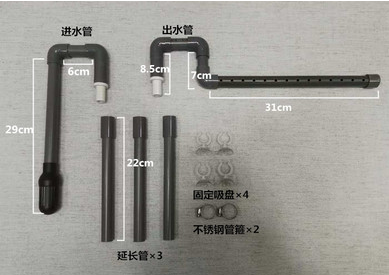
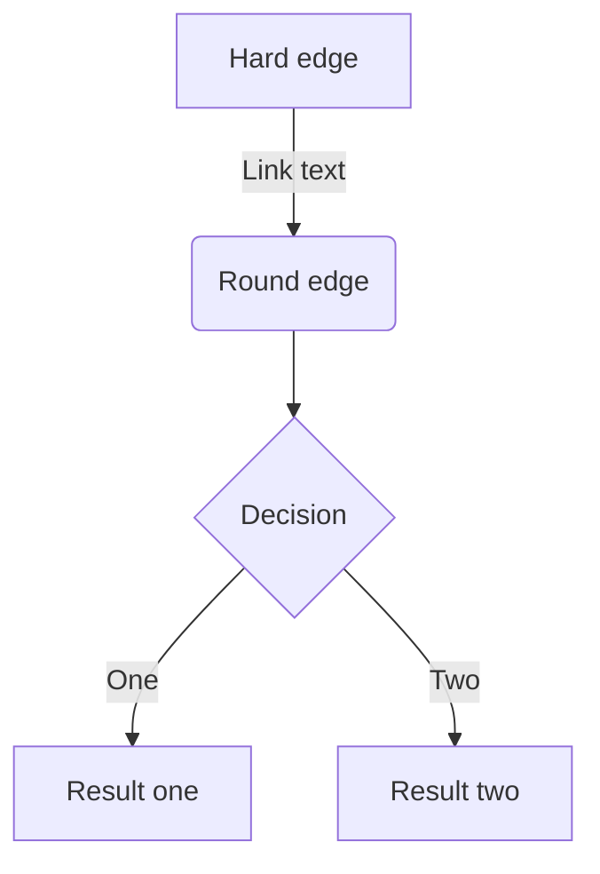
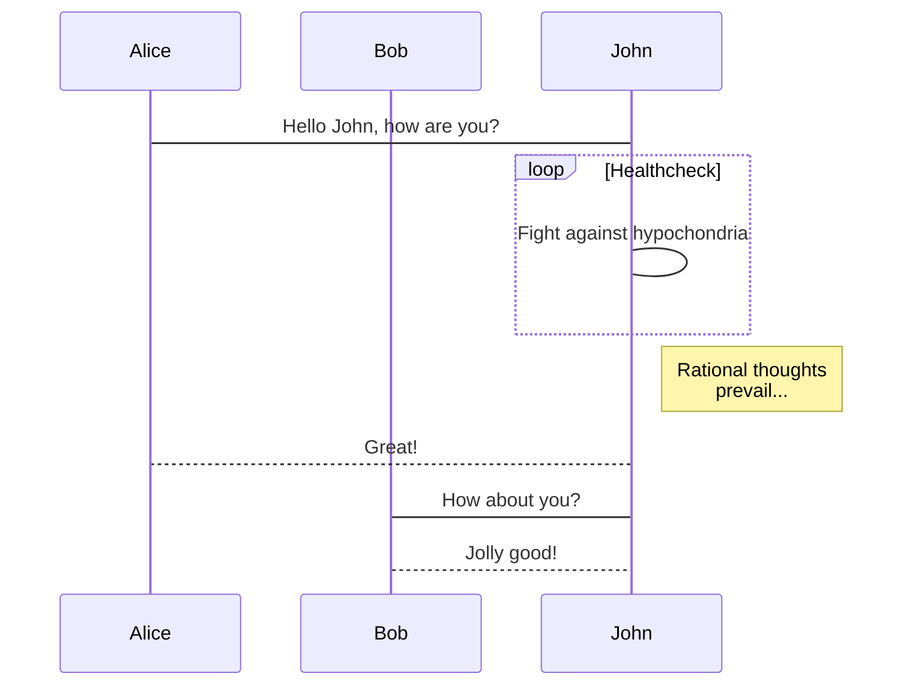

# Markdown 快速入门guide

**ctrl + shift + m ===>  预览**

## 1. 多级标题的方法

# 一级
## 二级
### 三级
\#最多六级

一级标题
==
二级标题
--
***
## 2. 引用和换行的方法

>引用内容 “。。。。。。。。。。”  
换行方法一 space add 1 Enter 等于换行
>>注释还可以嵌套
>>>在多一级


换行方法二使用</br>
注意部分格式符号和文字间需要空格
***
## 3. 字体处理的方法


*斜体一*   **加粗一**  
_斜体二_   __粗体二__

~~需要划出的内容~~  

<u>下划线的解决办法</u>

***

## 4. 列表
### 无序列表  
#### 无序列表的基本用法：
三种写法：* + -

使用 * ：
* 无序列表1
* 无序列表1
* 无序列表1

使用 + ：
+ 无序列表2
+ 无序列表2
+ 无序列表2

使用 - ：
- 无序列表3
- 无序列表3
- 无序列表3

#### 无序列表的嵌套：
* 张三
  * 30 岁
  * good man
  * 爱好聊天
* 李四
  * 25岁
  * 热血青年
  * 旅游交友

### 有序列表
#### 有序列表的基本用法：
1. 有序列表1
2. 有序列表1
3. 有序列表1

#### 有序列表的嵌套：
1. 概要
  * 概要一
  * 概要二
  * 概要三
2. 内容
  * 内容一
  * 内容二
  * 内容三
3. 总结
  * 总结一
  * 总结二
  * 总结三
***
## 5. 超链接
### 内联方式：
使用方法:[链接文字描述](链接地址)  
[baidu](http://baidu.com/)  
[文件引用](head.md)

### 引用方式：
I get 10 times more traffic from [Google][1] than from [Yahoo][2] or [MSN][3].  


以下引用放在文章末尾：  
[1]: http://google.com/        "Google"  
[2]: http://search.yahoo.com/  "Yahoo Search"  
[3]: http://search.msn.com/    "MSN Search"  

***

## 6. 添加图片  
添加本地图片  


  

添加网络图片  


***

## 7. 添加表格  
|编号|姓名|年龄|
|:---:|----:|:---|
| 1  | 张三 | 30 |
| 02  | 李四四 | 250 |
| 003  | 王五五五 | 2000 |

注：  :---代表左对齐，---:代表右对齐，:---:代表居中对齐，-数目至少一个，:没有默认左对齐，第二行必须有，否则不是表格形式。

## 8. 代码区  
多行代码框。使用``` 代码区 ```。  
单独一行` .... `（`不是单引号而是左上角的ESC下面~中的`）。
第二种：大片文字需要实现代码框，文字前按键盘Tab键。

```cpp
int main()
{

  ...

  return 0;
}
```

`  单行代码  `

## 9. 脚注
这是一个链接到谷歌的[^脚注]  
这是另一个脚注：[^注2]

[^注2]: 注释内容哈
[^脚注]: http://www.google.com


## 10. 其他补充


### 复选框
- [x] 选择1
- [x] 选中状态


### 流程图


#### drawing 1:

##### Flow Diagram

```flow
st=>start: start
e=>end: end
op=>operation: My operation
cond=>condition: Sure?

st->op->cond
cond(yes)->e
cond(no)->op
```


#### drawing 2:


***

##### UML Sequence Diagram



[详细的教程_点击这里](https://mermaidjs.github.io/flowchart.html)
